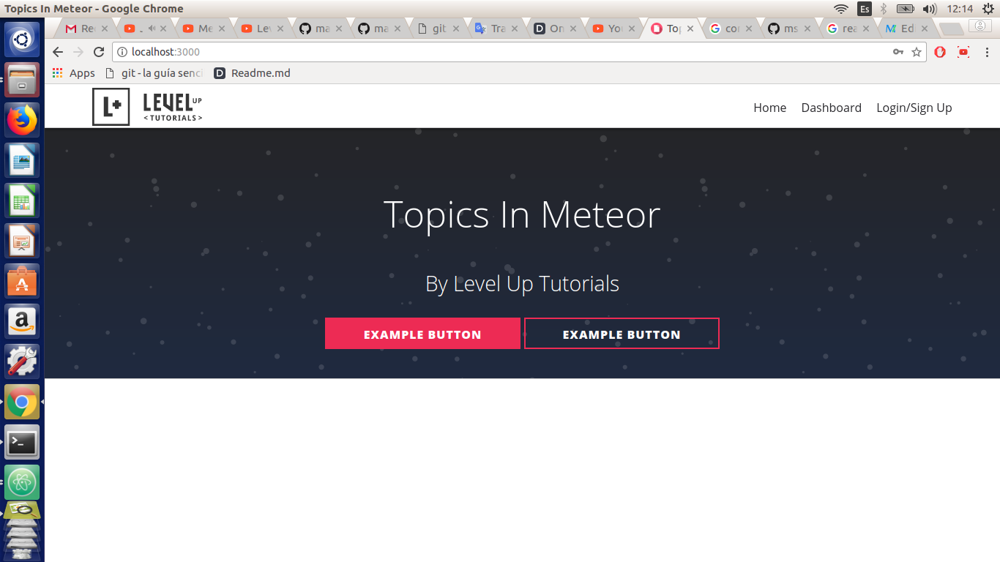
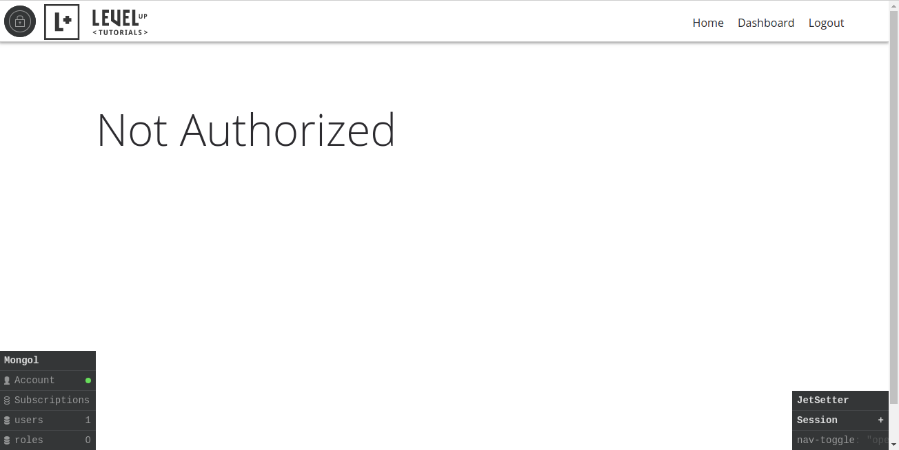
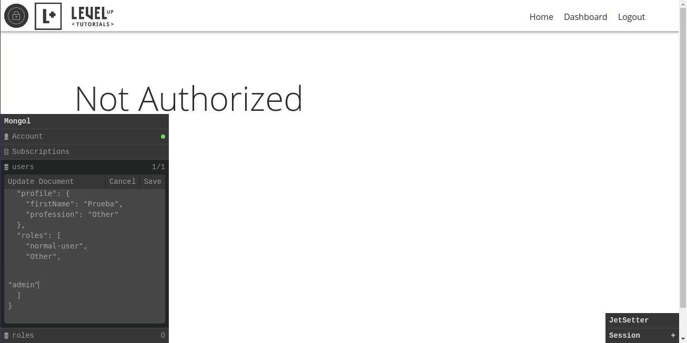
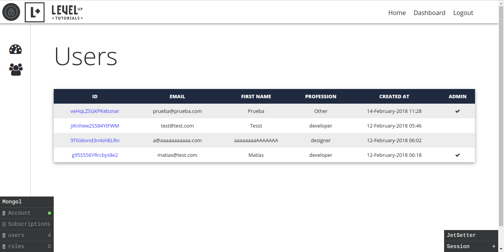
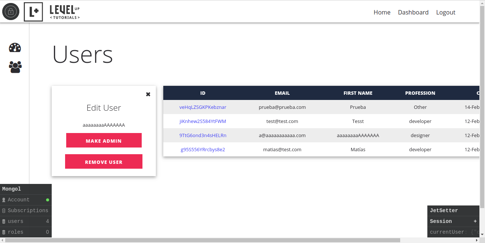

User Accounts Meteor
=============



**Spanish** / English

Hola, mi nombre es Matías Vilches ([matiasvilches](https://github.com/matiasvilches) en github) y les quiero compartir este proyecto que realicé hace poco gracias a un tutorial en Youtube.

El tutorial consta con 9 videos, Se llama "User Accounts in Meteor" del canal "[LevelUpTuts](https://www.youtube.com/channel/UCyU5wkjgQYGRB0hIHMwm2Sg)" (todos los creditos para ellos).

Se trabaja con JavaScript y Meteor, se crea una aplicación web donde puedes administrar Usuarios.

Link del tutorial: https://www.youtube.com/watch?v=T7T9y854uWw&index=1&list=PLLnpHn493BHFMTabI7UK28e0e_CwoiYv6

Instalación:
------------
1. Clonar este repositorio con HTTPS.
  	```
  	git clone https://github.com/matiasvilches/user-accounts-meteor.git
  	```

2. Entrar al directorio "user-accounts-meteor"
  	```
  	cd user-accounts-meteor
  	```

3. Ingresar los siguientes comandos.
  	```
  	meteor update
  	meteor npm install
  	meteor npm install --save @babel/runtime
  	meteor npm install --save bcrypt
  	meteor
  	```

Uso
----

1. Para poder manipular correctamente la aplicación primero deberás crear una cuenta. Luego de ingresar tienes que dirigirte a "Dashboard".



2. Para tener acceso a vizualizar los usuarios registrados deberás modificar tu cuenta a admin. Presiona "CTRL + M" para abrir "Mongol", dale a "Update" para poder editar la cuenta. Agrega "admin" en "roles" y dale a guardar.



3. Listo, ya eres administrador. Ahora dirigete a la barra izquierda y presiona "Users Management". Ahí podrás administrar todas las cuentas de usuario que hay registradas en la app.



4. Para modificar una cuenta normal a administrador o eliminar un usuario normal, deberás darle al "ID" del usuario para que muestre las opciones.



5. Mira el código y aprende, eso es bueno :p

---

Spanish / **English**

Hello, my name is Matías Vilches ([matiasvilches](https://github.com/matiasvilches) in github) and I want to share this project that I did recently thanks to a tutorial on YouTube.

The tutorial consists of 9 videos, called "User Accounts in Meteor" channel "[LevelUpTuts](https://www.youtube.com/channel/UCyU5wkjgQYGRB0hIHMwm2Sg)" (all credits for them).

It works with JavaScript and Meteor, a web application is created where you can manage Users.

Tutorial Link: https://www.youtube.com/watch?v=T7T9y854uWw&index=1&list=PLLnpHn493BHFMTabI7UK28e0e_CwoiYv6

Installation:
------------
1. Clone this repository with HTTPS.
  	```
  	git clone https://github.com/matiasvilches/user-accounts-meteor.git
  	```

2. Enter the directory "user-accounts-meteor"
  	```
  	cd user-accounts-meteor
  	```

3. Execute the following commands.
  	```
  	meteor update
  	meteor npm install
  	meteor npm install --save @babel/runtime
  	meteor npm install --save bcrypt
  	meteor
  	```

Usage
----

1. In order to properly handle the application you must first create an account. After entering you have to go to "Dashboard".


2. To have access to visualize registered users you will have to modify your account to admin. Press "CTRL + M" to open "Mongol", click "Update" to edit the account. Add "admin" in "roles" and save.


3. Ready, you are an administrator. Now go to the left bar and press "Users Management". There you can manage all the user accounts registered in the app.


4. To modify a normal account to administrator or delete a normal user, you must give the user "ID" to show the options.


5. Look at the code and learn, that's good: p
